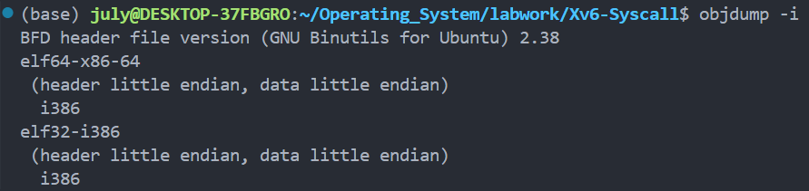
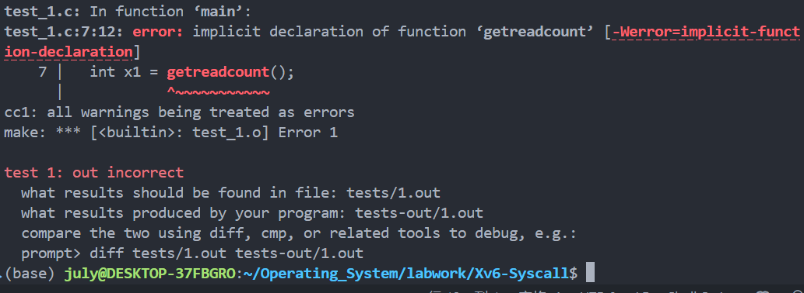

# Guide to Labworks by WQY

本文由吴健雄学院22级吴清晏编写，希望能帮助同学们顺利完成操作系统实验的准备工作，加深对操作系统的理解。

本文包含以下几个部分：

首先，课前准备部分，为使用Windows的同学提供了Linux虚拟机的安装教程，并根据自己在配置环境时遇到的问题和解决方法，希望能帮助同学们少走一些弯路。此外，还包括实验文件的下载以及Xv6的下载。后续可能还会添加其他内容。

## 课前准备教程

在开始前，需要明确你的需求：是仅仅想完成操作系统课程实验，还是想完全体验Linux的使用；是想仅使用命令行窗口，还是希望有一个完整的图形界面…无论如何，你都会需要的有：GNU编译环境安装，实验文件下载，Xv6配置。

此外，你可以选择在`wsl`和`VMware`中选择一个虚拟机平台(本教程仅针对Windows系统，因为Mac是Unix内核，不需要额外配置)

在这之后，你可以从`VS code`和其他文本编辑器(如`vim`，`nano`，`Emacs`等)中选择一种，个人推荐`VS code`。

### 虚拟机配置

#### VMware配置

如果你的需求仅仅是操作系统实验，那么wsl就足够了，占用空间更小，启动更方便，文件传输更便捷，**但是！**wsl对GUI(图形界面)的支持极差，如果你需要在Linux环境下运行带有图形界面的软件(如使用Open 3d库的Python脚本)，那么，你需要一个**完整**的Linux系统，包括图形界面。

网上有大量VMware的安装教程，这里推荐[这一篇](https://zhuanlan.zhihu.com/p/617093823)，安装完成后，你需要自己下载Linux安装镜像(.iso格式)，推荐通过东南大学最新搭建的[镜像站](https://mirrors.seu.edu.cn/)下载，推荐[Ubuntu22.04版本](https://mirrors.seu.edu.cn/ubuntu-releases/22.04/ubuntu-22.04.4-desktop-amd64.iso)。

#### WSL + Ubuntu

> 注意！只有Win10/11才能使用wsl！

1. 搜索`启动或关闭Windows功能`，打开`适用于Linux的Windows子系统`和`虚拟机平台`，并根据提示重启。

2. 打开Terminal，输入`wsl --update`。

   > Tips:
   >
   > 有时会显示`没有安装的分发版`，首先按照提示输入`wsl.exe --list --online`查看可以安装的系统，输入`wsl.exe --install <系统名>`完成安装，推荐选择`Ubuntu`

   > 如果你的电脑近期重新安装过`家庭版`系统，有可能出现`注册表缺失`报错，解决方法为安装[Win11专业版](https://software.seu.edu.cn/soft/detail/18)，安装完成后在`启动或关闭Windows功能`页面勾选`Hyper-V`，并重新打开两个功能。

3. 在安装过程中，提示输入用户名(不能有大写)和密码。

   ***在Linux系统中，密码默认隐藏，记住自己输了几位！***

   > 如果未完成用户设置就关闭了Ubuntu，将默认登录为root用户。
   >
   > 通过`passwd`命令设置root密码后，可通过`adduser <username>`添加用户，之后需要通过`adduser <username> sudo`命令给新用户添加管理员权限。
   >
   > 如果希望默认登录为普通用户(而不是root用户)，可通过`ubuntu config --default-user <username>`设置默认登录用户，注意这一行命令不是在Ubuntu，而是在Windows的`Terminal`或`Command`终端运行的。
   >
   > (以上指令请替换\<username>为用户名)

4. 在Ubuntu中，大部分命令都需要管理员权限(sudo)，但现在还没有设置管理员(root用户)密码，可通过`sudo passwd`设置，推荐采用与当前用户一样的密码，防止混淆。

#### GNU编译环境安装<span id='GNU'></span>

1. 进入Ubuntu，输入`sudo apt-get update`更新，根据提示输入管理员密码。

2. 输入`sudo apt-get install build-essential gdb`

   > build-essential包括了`gcc`,`g++`和`make`，其中`gcc`和`g++`分别为`c语言`和`c++`的编译器，`make`可以编译带有`makefile`文件的开源软件代码。
   >
   > GDB的全称是GNU Debugger，之后我们使用的VS code提供的断点调试等功能就是基于GDB的。

#### 文本编辑器安装

Ubuntu系统一般已经默认安装了vim和nano，CentOS系统一般只内置了vi，但通过自带的包管理器可以很方便的安装。`vim`、`emac`和`nano`都是基于命令行的文本编辑器，而`Gnome`和`VS code`都拥有图形界面，可以使用鼠标辅助编辑，也可以粘贴多行文本。

vim和nano教程很多，重点是快捷键的使用。Gnome是GNOME桌面的默认文本编辑器，个人认为在wsl上使用很鸡肋，推荐直接使用`VS code`。

在安装wsl版本的VS code前，需要先在Windows上[安装VS code](https://code.visualstudio.com/)，安装时推荐勾选`添加到右键菜单`

1. 在wsl中输入`code .`即可完成VS code安装，注意中间有空格。其实该命令主要用于在当前目录下启动VS code。

   > 如果使用较老的系统版本(如CentOS7)，可能无法正常安装VS code，因为最新版的VS code需要Glibc的版本大于等于2.28。推荐不要折腾老系统，换个新点的Linux。

2. 在VS code中选择`文件`->`打开文件夹`，输入`~`打开用户目录，新建`test.c`，输入以下内容

   (可根据提示安装C/C++插件)

```c
#include <stdio.h>
int main(int argc, char *argv[])
{
    printf("Hello World\n");
    return 0;
}
```

4. 点击右上角按钮运行，在编辑器选项中选择`gcc`，若输出为`Hello World`，则说明`GNU`的配置正常。

> 默认情况下，WSL会把虚拟机安装到C盘，但C盘往往空间比较紧张，如果希望把虚拟机安装到指定位置，可进行如下操作：<span id='export'></span>
>
> 1. Windows Terminal输入`wsl --shutdown`关闭，(`wsl -l -v`查看虚拟机状态)
> 2. 确认关闭后，输入`wsl --export Ubuntu D:\wsl2.tar`导出(以D:\wsl2.tar为例)
> 3. 导出完成后卸载原虚拟机`wsl --unregister Ubuntu`(假设虚拟机名称为Ubuntu)
> 4. `wsl --import Ubuntu D:\Ubuntu_WSL\ D:\wsl2.tar`导入(假设导入到D:\Ubuntu_WSL)

(本部分参考了[wsl官方教程](https://learn.microsoft.com/zh-cn/windows/wsl/setup/environment))

## 其他配置

这一部分**不推荐**执行，但如果确实有相关需求，或许能帮忙少走一些弯路。

### 配置git

1. Ubuntu默认已安装git，只需配置用户名和邮箱(改为自己的)
2. `git config --global user.name "Your Name"`
3. `git config --global user.email "youremail@domain.com"`
4. 如果Windows上没有安装Git，点击[链接](https://github.com/git-for-windows/git/releases/)下载并安装
5. `git config --global credential.helper "/mnt/c/Program\ Files/Git/mingw64/bin/git-credential-manager.exe"`
6. 可以尝试在VS Code中使用`源代码管理`进行推送与拉取
7. 如果把Projects放在Git仓库中，可通过在文件夹中添加`.gitignore`文件，输入`test*`忽略所有测试用代码

### 在Linux中安装Chrome浏览器

1. 输入`cd /tmp`打开临时目录
2. `wget https://dl.google.com/linux/direct/google-chrome-stable_current_amd64.deb`下载Chrome安装包
3. `sudo apt install --fix-missing ./google-chrome-stable_current_amd64.deb`安装
4. `sudo apt-get install ttf-wqy-zenhei`安装中文字体
5. 输入`google-chrome`启动浏览器

### 安装VS code插件(快捷打开网页)

​	输入`code .`打开VS Code，在拓展程序部分，搜索并安装插件`Open Browser Preview`

> Tips:
>
> Chrome自带了网页翻译功能，若未能检测出英文网页，按`F12`进入开发者工具，选中\<html>右键添加属性`lang="en"`将网站标注为英文)

### 配置中文输入法(强烈不推荐)

如果你希望在Linux的浏览器上像Windows系统上一样输入中文，可以尝试以下配置。

**该过程比较危险，推荐在尝试前先[导出备份](#export)**

1. 配置中文语言包

   ```shell
   sudo apt install language-pack-zh-hans
   ```

2. 编辑`/etc/locale.gen`，去掉`en_US.UTF-8 UTF-8` 及 `zh_CN.UTF-8 UTF-8`前的注释符号

   ```shell
   vim /etc/locale.gen
   ```

   (按i编辑，`ESC`+`:wq`保存并退出)

   ```shell
   sudo locale-gen --purge
   ```

3. 安装输入法

   ```shell
   sudo apt install fcitx fonts-noto-cjk fonts-noto-color-emoji dbus-x11
   ```

4. 安装输入模式

   ```shell
   sudo apt install <Package>
   ```

   其中package从`fcitx-libpinyin`，`fcitx-sunpinyin`，`fcitx-googlepinyin`中挑选一个

5. 切换到root用户，并创建bus连接

   ```shell
   su root
   dbus-uuidgen > /var/lib/dbus/machine-id
   ```

6. 创建新文件`vim /etc/profile.d/fcitx.sh`，输入

   ```shell
   #!/bin/bash
   export QT_IM_MODULE=fcitx
   export GTK_IM_MODULE=fcitx
   export XMODIFIERS=@im=fcitx
   export DefaultIMModule=fcitx
   
   #optional
   fcitx-autostart &>/dev/null
   ```

7. 在Windows终端中通过`wsl --shutdown`+`wsl`重启虚拟机

8. 输入`fcitx-config-gtk3`，不出意外的话，界面上出现之前安装的输入法。可通过Global Config调整切换输入法的快捷键。(如果失败，只能从导出的备份重新尝试)

9. 打开浏览器，验证输入法功能是否正常

   ````she
   google-chrome
   ````

## 下载实验文件

1. 点击[链接](https://seunic-my.sharepoint.cn/personal/101011912_seu_edu_cn/_layouts/15/download.aspx?SourceUrl=/personal/101011912_seu_edu_cn/Documents/教学/Teaching/操作系统/OSC_labs/Xv6.labworks.7z)下载并解压`labworks`，重命名为`projects`

```shell
cd ~
code .
```

2. 将文件夹从Windows文件资源管理器拖到VS code左侧的文件窗格中，右键选择在资源管理器中打开。接下来就可以像使用Windows一样打开`reverse`文件夹，点击README.html查看实验说明。

   > 如果之前配置了Linux浏览器和VS code插件，可选中文件并右键，选择
   >
   > `Preview In Default Browser`在Chrome中打开网页。

*另一种方案: 直接克隆[本仓库](https://github.com/julymiaw/Operating_System)(不推荐，因为仓库设置了gitignore，文件不全)*

## 下载Xv6

Xv6在后续的实验中将被使用，但它并不包含在刚刚的实验文件中。

# Guide to Lab works

## 总体介绍——以Reverse为例

在VS code中打开`~`目录，在`./projects/Reverse`下新建`reverse.c`文件。

### 需求分析

1. 支持3种输入形式：

	* `./reverse`
	* `./reverse input.txt`
	* `./reverse input.txt output.txt`

2. 对于输入的数据(命令行/文件)，**不能**假设*句子长度* 和*句子个数*。

3. 处理以下4种错误：

   * 输入参数过多：`usage: reverse <input> <output>`

   * 文件无法打开：`reverse: cannot open file '<filename>'`（其中`<filename>`为打不开的文件名）

   * 输入相同文件：`reverse: input and output file must differ`（不能仅通过文件名判断）

   * 内存分配失败：`malloc failed`

> 无论是哪一种错误，统一用`fprintf(stderr, "<error message>\n");`输出错误并`exit(1);`返回状态码1。
>
> 其中，stderr是一种特殊的输出流，与之类似的输出流是stdout，stdout类似c++中cout。
>
> 返回的状态码正常为0，调用exit函数会立即终止并返回指定状态码。

### 功能实现

```c
#include <stdio.h>
#include <stdlib.h>
#include <sys/stat.h>
```

1. 处理错误“输入参数过多”

```c
// 如果用户运行时reverse参数过多，则打印usage: reverse <input> <output>并退出，返回码为 1
if (argc > 3) {
    fprintf(stderr, "usage: reverse <input> <output>\n");
    exit(1);
}
```

2. 处理错误“文件无法打开”

```c
// 输入流，文件或命令行输入(Ctrl+D结束输入)
FILE *input = stdin;

// 输出流，文件或命令行输出
FILE *output = stdout;

// 如果提供输入文件，打开输入文件
if (argc >= 2) {
    input = fopen(argv[1], "r");
    if (input == NULL) {
        fprintf(stderr, "reverse: cannot open file '%s'\n", argv[1]);
        exit(1);
    }
}

// 如果额外提供输出文件，尝试打开，并检查输入输出文件是否相同(用stat防止硬链接)
if (argc == 3) {
    output = fopen(argv[2], "w");
    if (output == NULL) {
        fprintf(stderr, "reverse: cannot open file '%s'\n", argv[2]);
        exit(1);
    }
}
```

3. 通过头文件`<sys/stat.h>`提供的stat函数处理错误“输入相同文件”

```c
struct stat stat1, stat2;
stat(argv[1], &stat1);
stat(argv[2], &stat2);
if (stat1.st_ino == stat2.st_ino) {
    fprintf(stderr, "reverse: input and output file must differ\n");
    exit(1);
}
```

4. 分配初始内存，当容量不够时自动扩容，处理错误“内存分配失败”

```c
// 记录行数
int num_lines = 0;

// 记录容量，初始为10
int capacity = 10;

// 用于存储行的数组
char **lines = malloc(capacity * sizeof(char *));
if (lines == NULL) {
    fprintf(stderr, "malloc failed\n");
    exit(1);
}

size_t len = 0;
while (1) {
    if (num_lines == capacity) {
        capacity *= 2;
        lines = realloc(lines, capacity * sizeof(char *));
        if (lines == NULL) {
            fprintf(stderr, "malloc failed\n");
            exit(1);
        }
    }
    if (getline(&lines[num_lines], &len, input) == -1)
        break;
    num_lines++;
}
```

> `getline`函数在`len`设置为0时，会自动扩充输入缓冲区并更新`len`参数。
>
> 如果想通过终端测试零参数下的效果，可通过`Ctrl+D`终止输入流，此时`getline`函数会返回-1。

5. 将获取的所有句子逆序放入输出流，释放内存并关闭文件

```c
for (int i = num_lines - 1; i >= 0; i--) {
    fprintf(output, "%s", lines[i]);
    free(lines[i]);
}

free(lines);

if (input != stdin)
    fclose(input);
if (output != stdout)
    fclose(output);
```

> 注意，与C++不同，C语言中用malloc分配的内存一定要主动调用free函数进行内存释放，文件需要主动关闭，这是比较好的代码习惯。

### 编译文件并测试功能

1. 选中文件，右键“在集成终端中打开”

2. 输入`gcc -o reverse reverse.c -Wall`进行编译

3. 输入`sudo chmod 777 test-reverse.sh`对当前测试脚本的权限进行修改

   (你可能还需要输入`sudo chmod 777 ../tester/*`将其他测试脚本的权限设为最高)

4. 输入`./test-reverse.sh`进行测试。

   如果一切顺利的话，你会看到以下结果

   

## Kernel Hacking介绍

1. 在`Xv6-Syscal`文件夹中打开终端(wsl使用VS code的集成终端会更方便，常用快捷键与Windows相同)
```shell
git clone https://github.com/mit-pdos/xv6-public.git
```
有同学反馈git仓库无法连接，建议使用校园网或流量热点，一般都是可以直接连接的。

> 如果要将克隆的仓库上传到自己的仓库中，需要删除该仓库的`.git`隐藏文件夹。

2. 测试编译工具
```shell
objdump -i
```
​	我的输出如下:

​	如果第二行和我一样是`elf32-i386`就没问题了。如果正常完成[GNU配置](#GNU)，`gcc`版本一定不会有问题的。

3. 编译xv6

​	打开刚刚克隆的文件夹，例如`xv6-public`

```shell
cd xv6-public
make
```
4. 安装`qemu`虚拟机
```shell
sudo apt-get install qemu-system
```
(原先的命令已过时，[官网](https://www.qemu.org/download/#linux)已经更新了安装方式)

5. 用虚拟机启动Xv6

```shell
make qemu
```

### 开始实验

在文件夹`Xv6-Syscal`中打开终端。

首先，手动把刚刚的文件夹`xv6-public`改名为`src`，并修改测试文件权限。

```shell
sudo chmod 777 test-getreadcount.sh
./test-getreadcount.sh
```

如果不出意外的话，程序会开始运行，并抛出一个错误：



这是正常的，因为`getreadcount()`函数需要我们自己实现。

这一部分实验建议参考Xv6官方的[介绍](https://github.com/remzi-arpacidusseau/ostep-projects/tree/master/initial-xv6)，相比于现在的介绍多了一些Tips和教学视频。

### 功能分析

看一下test_1.c代码：

```c
#include "types.h"
#include "stat.h"
#include "user.h"

int main(int argc, char *argv[])
{
  int x1 = getreadcount();
  int x2 = getreadcount();
  char buf[100];
  (void)read(4, buf, 1);
  int x3 = getreadcount();
  int i;
  for (i = 0; i < 1000; i++)
  {
    (void)read(4, buf, 1);
  }
  int x4 = getreadcount();
  printf(1, "XV6_TEST_OUTPUT %d %d %d\n", x2 - x1, x3 - x2, x4 - x3);
  exit();
}
```

可以看到导入了3个头文件，其中`types.h`提供了一些基本类型的定义，`stat.h`提供了一个结构体`stat`的定义:

```c
#define T_DIR  1   // Directory
#define T_FILE 2   // File
#define T_DEV  3   // Device

struct stat {
  short type;  // Type of file
  int dev;     // File system's disk device
  uint ino;    // Inode number
  short nlink; // Number of links to file
  uint size;   // Size of file in bytes
};
```

这里，首先把所有文件分为了`目录`，`文件`和`设备`(Unix系统中，一般把设备看作特殊的文件对象)，这里所谓的`short type`就是以上3种类型之一。接下来，定义了`dev`设备编号，`ino`文件`incde`号，别名个数和文件大小。

系统调用至少需要修改以下文件:

| 文件      | 简介                        |
| --------- | --------------------------- |
| usys.S    | 提供系统调用入口            |
| syscall.h | 定义系统调用编号SYS_\<name> |
|           |                             |
|           |                             |

