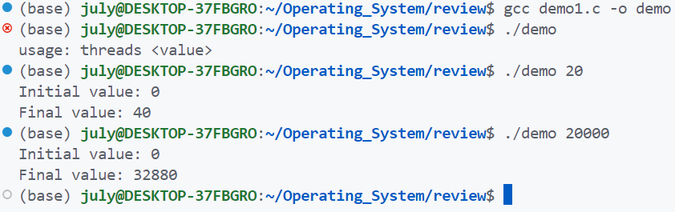

---
author:
- "**A/Prof. Kai Dong**"
date: 2024-04-12
subtitle: "**Chapter 6. Process Synchronization**"
title: "**OPERATING SYSTEM CONCEPTS**"
---

(本部分笔记为个人使用，对照原课件和《操作系统概念》课本完成，目标是在跟上课堂进度的同时充分利用中文课本的知识。本人基础较薄弱，一些常识性质的内容可能会额外注明)

# 第六章

(该部分十分关键！)

## 课前热身

### 输出什么?

``` c
/* thread.c */
#include <stdio.h>
#include <stdlib.h>
#include <common.h>

volatile int counter = 0;
int loops;

void *worker(void *arg) {
 int i;
 for (i = 0; i < loops; i++) {
 counter++;
 }
 return NULL;
}
```

``` c
int main(int argc, char *argv[]) {
 if (argc != 2) {
 fprintf(stderr, "usage: threads <value>\n");   
 exit(1);
 }
 loops = atoi(argv[1]);
 pthread_t p1, p2;
 printf("Initial value : %d\n", counter);

 Pthread_create(&p1, NULL, worker, NULL);
 Pthread_create(&p2, NULL, worker, NULL);
 Pthread_join(p1, NULL);
 Pthread_join(p2, NULL);
 printf("Final value : %d\n", counter);
 return 0;
}
```
> 这是课件上的热身题，其中有一些前置知识:
>
> 1. `void*`在c语言中被称为泛型指针，可以与其他类型指针进行相互转换。
> 2. `pthread_create`函数(首次介绍于第四次课件的第28页，属于Thread Libraries)
> 3. `pthread_join`函数(首次介绍与第四次课件的第30页)
> 4. `volatile`修饰符告诉编译器该值不是一个常量，即使它在这段代码中表现为常量，因为其他进程或线程可能会修改它。在之前的xv6实验中，如果测试用例没有出现类似问题，就是因为编译器进行了优化
>
> 以上代码的功能是，接受一个参数输入(loops)，新建两个进程，分别执行loops次`count++`指令，并打印前后count值变化。执行结果如下:
>
> 

可以看到，在循环数值较大时，最终结果不等于预期值。

### 并发

``` {.sh language="sh"}
prompt> gcc -o thread thread.c -Wall -pthread
prompt> ./thread 1000
Initial value : 0
Final value : 2000

prompt> ./thread 100000
Initial value : 0
Final value : 143012
prompt> ./thread 100000
Initial value : 0
Final value : 137298
```

-   在同一程序中同时做多件事会带来一系列问题，这些问题需要被解决。

### 目标

* 提出进程同步的概念
* 介绍临界区问题，临界区问题的解决方法被用于确保共享数据的一致性
* 提供临界区问题的软件和硬件解决方案
* 检查几个经典的过程同步问题
* 探索用于解决过程同步问题的几种工具

## 背景

-   进程(和线程)可以并发执行

    -   可能在任何时刻中断，只执行了一部分

-   对共享数据的并发访问可能导致数据不一致

-   为了维护数据一致性，需要确保协同进程有序执行
    
-   在我们的热身部分，什么数据是共享的？(count)

### 结果的不确定性

``` c
counter ++
```

以上代码被编译为

``` assembly
mov 0x8049a1c, %eax ; register1 = counter
add $0x1, %eax      ; register1 = register1 + 1
mov %eax, 0x8049a1c ; counter = register1
```

考虑$counter = 50$时的交错执行:

  $S0:$   p1 executes register1 = counter         (register1 = 50)
  $S1:$   p1 executes register1 = register1 + 1   (register1 =51)
  $S2:$   p2 executes register2 = counter         (register2 = 50)
  $S3:$   p2 executes register2 = register2 + 1   (register2 = 51)
  $S4:$   p1 executes counter = register1         (counter = 51)
  $S5:$​   p2 executes counter = register2         (counter = 51 [NOT 52]

> 这里的p1和p2代表两个线程，register代表寄存器。这里的关键点在于，++操作不是一个原子操作，包括读取，执行和写回三个部分。如果把这三步看作一条指令，那么第一步就是取数阶段，第二步是执行阶段，第三步是写回阶段，按照流水线的思想，这里的乱序执行带来了写后读和读后写问题。

不是因为多处理器！(接下来的例子说明了即使是单处理器，因为中断，也有可能导致问题)

### 不受控制的调度

| OS                                                         | Thread 1                                                     | Thread 2                                                     |        PC         |      %eax      |    counter     |
| :--------------------------------------------------------- | :----------------------------------------------------------- | :----------------------------------------------------------- | :---------------: | :------------: | :------------: |
|                                                            | *before critical section*<br>mov 0x8049a1c, %eax<br>add \$0x1, %eax |                                                              | 100<br>105<br>108 | 0<br>50<br>51  | 50<br>50<br>50 |
| **interrupt**<br>save T1's state<br>*restore T2's state*   |                                                              |                                                              |    <br><br>100    |   <br><br>0    |   <br><br>50   |
|                                                            |                                                              | mov 0x8049a1c, %eax<br/>add \$0x1, %eax<br>mov %eax, 0x8049a1c | 105<br>108<br>113 | 50<br>51<br>51 | 50<br>50<br>51 |
| **interrupt**<br/>save T2's state<br/>*restore T1's state* |                                                              |                                                              |   <br/><br/>108   |  <br/><br/>51  |  <br/><br/>50  |
|                                                            | mov %eax, 0x8049a1c                                          |                                                              |        113        |       51       |       51       |

* 问题的核心是不受控制的调度

-   如果我们有**一条**汇编指令"memory-add 0x8049a1c, \$0x1"是否就可以解决问题?

> 在刚刚的表格中，首次提到了临界区(critical section)。临界区是访问共享资源的一段代码，这段代码不能同时被多个执行线程访问。假设变量count被储存在0x8049a1c处，线程1在写回阶段前被中断，此时变量count中储存的数据还是原来的50，所以线程2在原先50的基础上执行加法，这导致了结果异常。

### 竞争条件

* 多个进程(线程)并发地访问和操作相同的数据，执行的结果取决于访问发生的特定顺序。
* 结果是不确定的！

## 临界区问题

-   考虑一个有n个进程的系统 $P_0, P_1, \cdots, P_{n-1}$

-   每个进程有一块**临界区**代码

    -   进程可能在修改公共变量，更新表格，写入文件等
        
    -   当一个进程处于临界区内时，其他进程都不应该在临界区
    
- **临界区**

  -   多线程地执行一段代码，这段代码可能导致**竞争或冒险问题**
  -   刚刚的例子中那些代码处于临界区内？

- **临界区问题**就是设计一种避免竞争或冒险问题的协议(protocol)

- 每个进程需要在**进入区**获取临界区的进入许可 , 可能会在退出**临界区**后进去**退出区**, 其他区域为**剩余区**

- 进程$P_i$的整体结构

  ``` c
  do {
      [进入区]
          [临界区]
      [退出区]
          [剩余区]
  } while (true);
  ```

- 一种处理进程$P_i$与进程$P_j$​的竞争或冒险问题的算法：

  ``` C
  // Pi
  do {
      while (turn == j); 
          critical section 
      turn = j; 
          remainder section 
  } while (true);
  ```

  ``` C
  // pj
  do {
      while (turn == i); 
          critical section 
      turn = i; 
          remainder section 
  } while (true);
  ```

- 这个解决方法正确吗？

### 临界区问题的解决方案(3个基本需求)

1. **互斥(Mutual Exclusion)**

   如果进程$P_i$正在它的临界区，那么任何其他进程都不应该在该临界区

2. **进步(Progress)**

   如果没有进程正在临界区(即上一个进程退出后)，如果还有其他进程处于进入区(即正在等待进入临界区)，那么这些进程之一将进入临界区，并且这一过程不能被无限拖延。(即，不能有一个或几个进程永远占据临界区，因为这样多进程将退化为单进程)

3. **有限等待(Bounded Waiting)**

   从一个进程申请进入临界区到它真正进入的这段时间，进入临界区的进程数是有限的(不能插队！)

*假设每个进程都可以在有限时间内执行完成！*

>在我看来，这三条规定就是：
>
>* 窗口就一个，不要挤；
>* 一个人不能一直占用窗口
>* 其他人不能插队，可以是先来后到，但不能一直轮不到我

### 操作系统的临界区问题

-   两种方法，取决于内核是抢占式还是非抢占式
    -   抢占式:
        
        允许准备运行的最高优先级任务随时抢占当前正在执行的任务。
        
    -   非抢占式:
        
        只有当前任务自愿放弃 CPU 时，新的更高优先级任务才能获得对 CPU 的控制。
        
        -   非抢占式内核在内核模式中不会遇到竞争条件
    
-   抢占式内核存在潜在问题，为什么还要选择抢占式？
    
    -   抢占式内核的任务级响应时间是确定性的，因为你可以确定最高优先级任务何时可以控制 CPU。
    -   这可以防止内核持续被同一任务长时间占用

## 互斥锁(Mutex Locks)

(课本上在6.5介绍该问题，课件上改变了这一部分的顺序)

### 基本概念

#### 调度控制

-   我们需要使用**硬件同步原语(Hardware synchronization primitives)**，其中一个重要的原语就是**锁（Lock）**。

    -   锁相关的源代码通常放置在临界区周围，以确保任何这样的临界区都像单个**原子指令**一样执行。
-   锁本质上是一个**变量**。
-   如何使用锁：
    * 声明一个**锁变量**（例如，mutex）。
    * 锁变量保存着**锁的状态**。
    * 它可以是**可用**（或**未锁定**或**空闲**），表示没有线程持有该锁；
    * 或者是**已获取**（或**已锁定**或**持有**），表示恰好有一个线程持有该锁。

> 就像刚刚的例子一样，如果有一个单独的指令完成++操作，问题就解决了，因为指令在不考虑流水线的情况下是不可分割的。所以，我们需要的其实不是一个指令，而是一系列不可分割的操作，也就是**原子指令**。
>
> 使用原子的锁(所有指令都是硬件实现的)，就可以包装出任意原子指令。

#### 锁

-   以进程$P_i$为例

    ``` c
    do { 
        lock();
            critical section 
        unlock(); 
            remainder section 
    } while (true); 
    ```

- 那么lock()和unlock()的语义是什么呢？

#### lock() 和 unlock() 操作的语义

* **lock()** 操作的语义：
  * 调用 lock() 会尝试获取锁。
  * 如果没有其他线程持有该锁（即锁是空闲的），那么该线程将获得锁并进入临界区；有时也称该线程为锁的所有者。
  * 如果另一个线程在同一个锁变量上调用 lock()，它将不会返回，因为锁已被其所有者持有。
  * 其他线程在第一个持有锁的线程进入临界区时被阻止进入临界区。
* **unlock()** 操作的语义：
  * 一旦锁的所有者调用 unlock()，锁现在变为可用（空闲）状态。
  * 如果没有其他线程正在等待该锁，那么锁的状态将简单地更改为可用；否则，等待的线程之一将注意到锁状态的这一变化，获取锁并进入临界区。

> 这两个都是原子操作，并且需要符合3个特性，这3个特性与之前临界区问题的3个要求类似：
>
> * **互斥性（Mutual Exclusion）**：在任何时刻，只有一个线程可以持有锁。如果一个线程已经持有了锁，其他线程必须等待。
>
> * **原子性（Atomicity）**：lock() 和 unlock() 操作本身是原子的，不会被其他线程中断。这确保了在执行这些操作期间不会发生竞态条件。
>
> * **有序性（Ordering）**：lock() 和 unlock() 操作的执行顺序必须与线程的调用顺序一致。例如，如果线程 A 先调用了 lock()，那么线程 B 在之后调用 lock() 时必须等待线程 A 释放锁。
>
> 这三个要求类似于互斥和有限等待。进步问题被转化为"任意进程必须在获取锁之后的有限时间内释放锁"

#### Pthread库提供的互斥锁

> pthread 是 POSIX 线程库的缩写，它是一套用于多线程编程的标准接口。这个库允许程序员在同一个进程中创建和管理多个线程，以便并发地执行任务。

- 进入 & 退出

  ``` C
  // 获取一个互斥锁。如果锁当前被其他线程持有，调用线程会被阻塞，直到锁被释放。
  int pthread_mutex_lock(pthread_mutex_t *mutex);
  // 释放一个互斥锁，允许其他线程获取它。
  int pthread_mutex_unlock(pthread_mutex_t *mutex);
  ```

-   初始化

    ``` c
    pthread_mutex_t lock = PTHREAD_MUTEX_INITIALIZER;
    int rc = pthread_mutex_init(&lock, NULL);
    assert(rc == 0)
    ```
    
-   销毁
    ``` C
    pthread_mutex_destroy(&lock);
    pthread_mutex_destroy(lock);
    ```
    
-   其他版本

    ``` c
    int pthread_mutex_trylock(pthread_mutex_t *mutex);
    int pthread_mutex_trylock(pthread_mutex_t *mutex, struct timespec *abs_timeout);
    ```

> 这一部分曾经给我造成了一些困扰。后来发现课件上的函数定义存在问题，此处已修改。我认为更合适的讲解顺序是先初始化，在获取锁或解锁，最后销毁锁。
>
> 在初始化部分，这样先使用宏定义，再调用初始化函数的做法可能比较少见，因为C++中有类和构造函数，而C语言中只有结构体，这里的宏定义应该就是一个空的结构体，初始化函数来提供初始值。
>
> pthread_mutex_init函数的返回值正常为0，`assert(rc == 0)`是断言语句，当初始化失败时中断程序。在初始化后，锁的状态是已初始化但未锁定。在调用pthread_mutex_destroy函数后，可以让锁回到未初始化状态。
>
> 其他版本部分，这两个函数与直接获取锁不同，即使获取失败，该进程也不会阻塞，而是立即返回一个非零值，一般为`EBUSY` 错误。该函数还可以接受一个超时参数，等待超时才会返回。

### 锁的建立

-   操作系统如何创建锁？

    -   取决于硬件同步原语的支持
    
-   创建锁的方法

    -   无特殊硬件支持(纯软件实现)：

        * **Dekker 算法**和**Peterson 算法**
    * Lamport’s Bakery 算法
    
-   有硬件支持
    
    -   控制中断：通过控制中断来实现临界区的互斥。
    
    -   **test-and-set**指令：原子交换操作，用于获取锁。
        
    -   **compare-and-swap**指令：原子操作，用于更新共享数据。
    
        (省略了无须掌握的方法)

- 关于自旋等待

  * 自旋等待是一种在获取锁之前不断尝试的策略。
  * 它适用于短暂的临界区，但长时间的自旋等待会浪费 CPU 资源。

#### 控制中断

-   对于单处理器系统

    -   早期互斥问题解决方案是在临界区关中断。这样就可以避免课程热身环节遇到的问题。
        
        ``` c
        void lock() {
            DisableInterrupts();
        }
        void unlock() {
            EnableInterrupts();
        }
        ```
        
    - $Disable/EnableInterrupts$()通过特殊硬件指令实现。
    
-   是否是解决临界区问题的完美方案？
    
    -   **互斥性 (Mutual Exclusion)**：是的，通过禁用中断，确保了同一时间只有一个线程可以进入临界区。
    -   **进展性 (Progress)**：是的，因为其他线程被阻塞，临界区内的代码可以继续执行。
    -   **有界等待性 (Bounded Waiting)**：不一定。如果其他线程频繁地获取锁，可能导致饥饿问题。

- 性能考虑

  * 禁用中断会导致其他中断被阻塞，从而影响系统的响应性。
  * 如果临界区很小且频繁进入，性能开销可能会很大。

**控制中断的负面影响**

-   这种方法要求我们允许任何调用线程执行特权操作（打开/关闭中断），并且要相信这个功能不会被滥用。
    -   一个**贪婪的程序**可能在执行开始时调用 `lock()`，从而垄断处理器。更糟糕的是，错误或恶意的程序可能调用 `lock()` 并进入无限循环。

-   这种方法**不适用于多处理器**。
    -   线程可以在其他处理器上运行，因此可能在中断被控制的情况下进入临界区。(之前的热身示例提到中断是为了证明单处理器也会出现竞争错误，而更多竞争问题是多处理器带来的)

-   可能丢失中断：
    * 例如，如果 CPU 没有察觉到磁盘设备已完成读取请求，操作系统将如何知道唤醒等待该读取的进程？

-   可能效率低下：
    * 屏蔽或解除屏蔽中断的代码执行速度较慢。
    * 频繁启用/禁用中断可能会影响系统性能。

#### Peterson算法(纯软件)

算法假设**load**和**store**指令是原子的，即不会被中断

该算法适用于两个进程交错执行的情况。两个进程共享以下两个变量：

``` C
int turn;
Boolean flag[2];
```
-   $turn$表示现在轮到哪个进程进入临界区

-   $flag$数组表示进程是否在进入区(是否准备好进入临界区)

```c
// Algorithm for Process Pi
do {
	flag[i] = true;
 	turn = j;
	while (flag[j] && turn == j);// 空语句，用于阻塞进程
	/* 临界区 */
 	flag[i] = false;
 	/* 剩余区 */
} while (true);
```

``` C
// Algorithm for Process Pj
do {
 	flag[j] = true;
 	turn = i;
 	while (flag[i] && turn == i);
 	/* 临界区 */
 	flag[j] = false;
 	/* 剩余区 */
} while (true);
```

-   证明该算法满足临界区问题的三个要求

> 个人认为，这样表述并不是很好理解。我调整了一下内部循环的顺序：
>
> ```c
> do {
>  	// 当进程j已经准备好并轮到它时，阻塞
> 	while (flag[j] && turn == j);
> 	/* 临界区 */
> 	flag[i] = false;// 退出语句，释放锁
> 	/* 剩余区 */
>     turn = j;	// 自己完成处理后，把进程让给另一个进程j
>     flag[i] = true;// 完成准备，到进入区
>     /* 进入区 */
> } while (true);
> ```
>
> 假设此前turn为i，j以外的值。之后两个进程分别完成处理后，会对turn变量进行两次赋值，前一次被覆盖。
>
> 之前上课时，有同学提到当其中一个进程无须再次执行时，另一个进程也会随之停止。这取决于退出语句的位置。当退出逻辑位于剩余区时，不存在该问题，因为另一进程永远不会到进入区，而进入区为空时，另一进程不会被阻塞。

##### 下列变种的错误?

1. 去除轮次变量

``` c
// 第一种顺序
do {
    while (flag[j]);
    flag[i] = true;
    /* 临界区 */
    flag[i] = false;
    /* 剩余区 */
} while (true);
```

假设一个极端的情况：初始两个flag都为false，进程`i`退出循环，执行`flag[i] = true`前被中断，进程`j`同样退出循环，此时两个进程可以同时进入临界区，导致互斥问题。

``` C
// 第二种顺序
do {
    flag[i] = true;
    while (flag[j]);
    /* 临界区 */
    flag[i] = false;
    /* 剩余区 */
} while (true);
```
这样修改后，带来了新的问题：假设进程`i`在执行完flag[i] = true后被中断，进程`j`也将flag[j]设为true，之后两个进程同时进入等待状态，导致死锁。

- 去除flag数组
``` c
do {
    victim = i;
    while (victim == i);
    /* 临界区 */
    /* 剩余区 */
} while (true);
```
这样会带来之前提到的问题：其中一个进程结束后，将没有进程为它解锁。

#### Bakery算法

Peterson算法只能处理两个进程的交替访问临界区，**Bakery算法**是一种多个进程之间的互斥访问临界区的算法。它的设计灵感来自于一家面包店，每位顾客都会取一个独特的号码，然后按照号码的顺序进入店内。

-   每个进程在进入临界区之前都会获取一个号码，类似于面包店的号码系统。持有最小号码的进程有权进入临界区，其他进程必须等待。
    
-   如果两个进程收到相同的号码，按照进程编号大小决定谁先被服务。
    
-   号码总是按照递增的顺序生成，例如$1,2,3,3,3,3,4,5,\cdots$
    
-   定义的两个操作符：

    -   $(a,b) < (c,d)$ if $a < c$ or if $a = c$ and $b < d$

    -   $\max (a_0,\cdots, a_{n-1})=k$，也就是说$k \geq a_i, \forall i\in[0,n]$
    
-   共享数据
    ``` c
    boolean choosing[n];    // 初始化为false
    int number[n];  // 初始化为0
    ```

##### 代码实现

``` c
do {
    // 
    choosing[i] = true;
    number[i] = max(number[0], number[1], ... , number [n - 1]) + 1;
    choosing[i] = false;
    for (j = 0; j < n; j ++) {
        while (choosing[j]);
        while ((number[j] != 0) && ((number[j], j) < (number[i], i))); 
    }
    /* 临界区 */
    number[i] = 0;
    /* 剩余区 */
} while (true);
```

在这段代码中，有一个小锁（choosing）用于保证取号操作和读取编号操作是互斥的。在循环的每一轮，都会先检查该进程是否正在取号，如果进程`i`正在取号，说明进程`i`丢弃了空号0，换成了新号码，如果进程`j`读取了旧号码0，可能会因为number[j] != 0跳出循环进入临界区，而进程`i`的新号码比进程`j`大，进程`j`同样可以进入临界区，这违背了互斥原则。

#### 总结

起初人们大量研究软件的解决方法，直到人们意识到采用一些硬件支持会简单很多。

此外，以上软件方法在现代计算机中可能不生效，因为**宽松的内存一致性模型**（relaxed memory consistency model），对于其他进程来说，内存访问可以是乱序的。

### Test-And-Set

#### 失败尝试

``` c
typedef struct __lock_t { int flags; } lock_t;

void init(lock_t *mutex) {
    mutex->flag = 0;    // 0 -> lock is available, 1 -> held
}

void lock(lock_t *mutex) {
    while (mutex->flag == 1) //TEST the flag
        ;       // spin-wait (do nothing)
    mutex->flag = 1;    // now SET it!
}

void unlock(lock_t *mutex) {
    mutex->flag = 0;
}
```
因为加锁过程不是原子的，只要在flag被设为1前，两个进程都离开循环，就可以同时进入临界区。

*只需要将关键步骤封装为原子操作即可避免*

#### 硬件支持

``` c
int TestAndSet(int *old_ptr, int new) {
    int old = *old_ptr;
    *old_ptr = new;
    return old;
}
```

- 返回指针指向的旧值，同时将指向值升级为新值。

  注意！这一系列操作是**原子的**，通过硬件指令实现的。

- Test-and-set包括两步：

  -   $test$ 获取并返回旧值
  -   $setting$ 设为新值

- 问题：如何基于该指令设计一个锁？

#### 问题解决

``` c
typedef struct __lock_t { int flag; } lock_t;

void init(lock_t *lock) {
    lock->flag = 0; // 0 -> available, 1 -> held
}

void lock(lock_t *lock) {
    while (TestAndSet(&lock->flag, 1) == 1)
        ;   // spin-waiting
}

void unlock(lock_t *lock) {
    lock->flag = 0;
}
```

> 刚刚的代码中，加锁分为两步：
>
> ```c
> while (mutex->flag == 1) //TEST the flag
>    	;       // spin-wait (do nothing)
>     mutex->flag = 1;    // now SET it!
> ```
>
> 修改后将test与set合并为一个原子指令test and set，这样当旧值为0时，只会有一个进程获取到0并退出循环，这个过程不可分割。
>
> 但如果一个进程一直持有锁，那么其他进程将一直自旋等待，这同样无法满足公平性问题，也就是有限等待问题

### Compare And Swap

#### 硬件支持

传入3个参数，如果$ptr$指向的值符合预期(expected)，则将其设为新值。无论是否符合预期，都返回旧值。

``` c
int CompareAndSwap(int *ptr, int expected, int new) {
    int actual = *ptr;
    if (actual == expected)
        *ptr = new;
    return actual;
}
```

问题：如何基于该指令设计一个锁？

#### 问题解决

``` c
void lock(lock_t *lock) {
    while (CompareAndSwap(&lock->flag, 0, 1) == 1)
        ;   // spin-waiting
}
```

-   Compare-and-swap指令比test-and-set指令的功能更强大，可被用于实现“无锁并发”。

> 这里提到了一个概念：lock-free。无锁并发要求多个尝试获取锁的进程中至少有一个正常执行。
>
> CompareAndSwap是lock-free算法的基础，因为它保证了数据只在符合预期时才进行修改。

下面是一个无锁并发的例子：

-   要实现一个并发的自增函数，(使用锁的话)需要3步

    -   lock(); update counter; unlock();

-   使用CAS可以实现无锁的并发，保证至少一个进程完成操作。

``` c
// 修改了CAS的定义：修改成功返回1，否则返回0。
int CompareAndSwap(int *ptr, int expected, int new) {
    int actual = *ptr;
    if (actual == expected) {
     *ptr = new;
     return 1;
    }
    return 0;
}
```
``` c
void AtomicIncrement(int *counter, int amount) {
    do {
        int old = *counter;
    } while (CompareAndSwap(counter, old, old+amount) == 0);
}
```

-   优点是，不会带来死锁。

### Load-Linked and Store-Conditional

``` c
int LoadLinked(int *ptr) {
    return *ptr;
}

int StoreConditional(int *ptr, int value) {
    if (no one has updated *ptr since the LoadLinked to this address) {
        *ptr = value;
        return 1;   // success!
    } else return 0;    // failed to update
}

void lock(lock_t *lock) {
    while (true) {
        while (LoadLinked(&lock->flag) == 1)
            ;   // spin-waiting
        if (StoreConditional(&lock->flag, 1) == 1)
            return;
    }
}

/* or a simplified version */
void lock(lock_t *lock) {
    while (LoadLinked(&lock->flag) || !StoreConditional(&lock->flag, 1))
        ;       // spin-waiting
}
```
:::

::: frame
Mutex Locks

### How to Satisfy Bounded Waiting?

``` c
/* C-like pseudo code */
Initially Boolean waiting[i] = false; lock = false;

lock() {
    waiting[i] = true;
    while (waiting[i] && (TestAndSet(lock, 1) == 1));
    waiting[i] = false;
}

unlock() {
    j = (i + 1) % n;
    while ((j != i) && !waiting[j])
        j = (j + 1) % n;
    if (j == i)
        lock = false;
    else
        waiting[j] = false;
}
```
:::

::: frame
Mutex Locks

### Fetch And Add

-   Atomically increments a value while returning the old value at a
    particular address.

``` c
int FetchAndAdd(int *ptr) {
    int old = *ptr;
    *ptr = old + 1;
    return old;
}

/* ticket lock */
typedef struct __lock_t { int ticket; int turn; } lock_t;
void lock_init(lock_t *lock) {
    lock->ticket = 0;
    lock->turn = 0;
}
void lock(lock_t *lock) {
    int myturn = FetchAndAdd(&lock->ticket);
    while (lock->turn != myturn);
}
void unlock(lock_t *lock) {
    lock->turn = lock->turn + 1;
}
```
:::

::: frame
Mutex Locks

### Spin-Waiting

-   When a thread waits to acquire a lock that is already held, it
    endlessly checks the value of flag, a technique known as
    [spin-waiting]{.alert}.

-   [Hardware support]{style="color: blue"} for locks --- [Spin
    locks]{.alert} are simple and they work, and can be fair (as with
    the case of the ticket lock), but also can be quite
    [inefficient]{style="color: blue"}.

-   Think about $N$ threads contending for a lock; $N - 1$ time slices
    may be wasted.

-   [How to solve this problem?]{style="color: blue"}

-   Hints: some [OS support]{style="color: blue"} like de-scheduling.
:::

::: frame
Mutex Locks

### Yield

-   Assuming an OS primitive $yield$().

-   $yield$() is simply a system call that moves the caller from the
    running state to the ready state. Process de-schedules itself.\

    ``` c
    void lock() {
        while (TestAndSet(&flag, 1) == 1)
            yield();    //give up the CPU
    }
    
    void unlock() {
        flag = 0;
    }
    ```

-   Better than spin, but still $inefficient$.

-   Think about $N$ threads contending for a lock; $N - 1$ threads may
    execute the run-and-yield pattern.

-   Starvation
:::

::: frame
Mutex Locks

### Using Queues

-   The real problem:

    -   The scheduler determines which thread runs next.

    -   Solution: exert some control over scheduling.

-   A [queue]{style="color: blue"} can be used to keep track of which
    threads are waiting to acquire the lock.

-   E.g. two calls provided by Solaris.

    -   $park$() puts a calling thread to sleep.

    -   $unpark$($threadID$) wakes a particular thread as designated by
        threadID.
        :::

::: frame
Mutex Locks

### park() and unpark()

``` c
typedef struct __lock_t {
 int flag;
 int guard;
 queue_t *q;
} lock_t;

void lock_init(lock_t *m) {
 m->flag = 0;
 m->guard = 0;
 queue_init(m->q);
}
```

``` c
void_lock(lock_t *m) {
 while (TestAndSet(&m->guard, 1) == 1); // acquire guard
 if (m->flag == 0) {
 m->flag = 1;
 m->guard = 0; // release guard
 } else {
 queue_add(m->q, gettid());
 (*@$\textcolor[rgb]{.5,.5,.5}{\texttt{setpark();}}$@*) // will be introduced
 m->guard = 0; // release guard
 park();
 }
}

void unlock(lock_t *m) {
 while (TestAndSet(&m-guard, 1) == 1); // acquire guard
 if (queue_empty(m->q))
 m->flag = 0;
 else
 unpark(queue_remove(m->q));
 m->guard = 0; // release guard
}
```
:::

::: frame
Mutex Locks

### setpark()

-   Race condition before the call to $park$(): With just a wrong timing
    switch, the subsequent park by the first thread would then sleep
    forever (potentially).

-   A third system call: $setpark$()

-   A thread indicates it is about to park.

-   If it then happens to be interrupted and another thread calls
    $unpark$() before $park$() is actually called, the subsequent
    $park$() returns immediately instead of sleeping.\

    ::: uncoverenv
    ``` c
    queue_add(m->q, gettid());
    setpark();
    m->guard = 0;
    ```
    :::

-   Is spin avoided? No, but the time spent spinning is quite limited.
:::

::: frame
Mutex Locks

### Spin-Waiting (contd.)

-   when can spin-waiting be useful?

    -   No context switch is required

    -   On multi processor systems, one thread can spin on one processor
        while another thread performs its critical section on another
        processor.

-   Two-phase locks in Linux

    -   In the first phase, the lock spins for a while, hoping that it
        can acquire the lock.

    -   If the lock is not acquired during the first spin phase, a
        second phase is entered, where the caller is put to sleep, and
        only woken up when the lock becomes free later.
        :::

::: frame
Mutex Locks

### Spin-Waiting (contd.)

-   Correctness reason to avoid spinning: **[priority
    inversion]{.alert}** --- A higher-priority thread waiting for a lock
    held by lower-priority thread.

-   If the lock is a spin lock, the higher priority thread spins
    forever, and the system is hung.

-   With more threads and priority levels, the problem becomes more
    complicated.

    -   Imagine three threads, $T_1$, $T_2$, and $T_3$, with $T_3$ at
        the highest priority, and $T_1$ the lowest.

    -   $T_1$ grabs a lock.

    -   $T_3$ starts and tries to acquire the lock that T1 holds, and
        gets stuck waiting.

    -   $T_2$ starts. Now $T_3$, which is at higher priority than $T_2$,
        is stuck waiting for $T_1$, which may never run now that $T_2$
        is running.

-   **[priority inheritance]{.alert}** --- a higher-priority thread
    waiting for a lower-priority thread can temporarily boost the lower
    thread's priority, thus enabling it to run and overcoming the
    inversion.
    :::

## Locked Data Structures

::: frame
Locked Data Structures

-   How to add locks to a data structure to make it usable by threads
    makes the structure thread safe.

-   Consider both correctness and Performance

    -   Concurrent Counter

    -   Concurrent Linked List

    -   Concurrent Queue

    -   Concurrent Hash Table
:::

::: frame
Locked Data Structures

### Non-concurrent Counter

``` c
typedef struct __counter_t {
    int value;
} counter_t;

void init(counter_t *c) {
    c->value = 0;
}

void increment(counter_t *c) {
    c->value++;
}

void decrement(counter_t *c) {
    c->value--;
}

int get(counter_t *c) {
    return c->value;
}
```
:::

::: frame
Locked Data Structures

### Concurrent Counter

``` c
typedef struct __counter_t {
    int value;
    pthread_mutex_t lock;
} counter_t;
void init(counter_t *c) {
    c->value = 0;
    pthread_mutex_init(&c->lock, NULL);
}
void increment(counter_t *c) {
    pthread_mutex_lock(&c->lock);
    c->value++;
    pthread_mutex_unlock(&c->lock);
}
void decrement(counter_t *c) {
    pthread_mutex_lock(&c->lock);
    c->value--;
    pthread_mutex_unlock(&c->lock);
}
int get(counter_t *c) {
    pthread_mutex_lock(&c->lock);
    int rc = c->value;
    pthread_mutex_unlock(&c->lock);
    return rc;
}
```
:::

::: frame
Locked Data Structures

### Concurrent Counter (contd.)

-   Performance is still a problem

    -   A single thread completes in 0.03 seconds, where two threads
        complete in more than 5 seconds!

-   Sloppy counter
:::

::: frame
Locked Data Structures

### Sloppy Counter

-   local counter + local lock

-   global counter + global lock

    Time               $L_1$                 $L_2$   $L_3$                $L_4$                $G$
------ ---------------------------------- ------- ------- ---------------------------------- -----------------
       0                 0                     0       0                    0                  0
       1                 0                     0       1                    1                  0
       2                 1                     0       2                    1                  0
       3                 2                     0       3                    1                  0
       4                 3                     0       3                    2                  0
       5                 4                     1       3                    3                  0
       6  5$\rightarrow$`<!-- -->`{=html}0     1       3                    4                  5 (from $L_1$)
       7                 0                     2       4     5$\rightarrow$`<!-- -->`{=html}0  10 (from $L_4$)
:::

::: frame
Locked Data Structures

### Sloppy Counter (contd.)

``` c
typedef struct __counter_t {
 int global;
 pthread_mutex_t glock;
 int local[NUMCPUS];
 pthread_mutex_t llock[NUMCPUS];
 int threshold;
} counter_t;

void init(counter_t *c, int threshold) {
 c->threshold = threshold;
 c->global = 0;
 Pthread_mutex_init(&c->glock, NULL);
 for (int i = 0; i < NUMCPUS; i ++) {
 c->local[i] = 0;
 pthread_mutex_init(&c->llock[i], NULL);
 }
}
```

``` c
void update(counter_t *c, int threadID, int amt) {
 int cpu = threadID % NUMCPUS;
 pthread_mutex_lock(&c->llock[cpu]);
 c->local[cpu] += amt;
 if (c->local[cpu] >= c->threshold) {
 pthread_mutex_lock(&c->glock);
 c->global += c->local[cpu];
 pthread_mutex_unlock(&c->glock);
 c->local[cpu] = 0;
 }
 pthread_mutex_unlock(&c->llock[cpu]);
}

int get(counter_t *c) {
 pthread_mutex_lock(&c->glock);
 int rc = c->global;
 pthread_mutex_unlock(&c->glock);
 return rc;
}
```
:::

::: frame
Locked Data Structures

### A Simple Concurrent Linked List

``` c
typedef struct __node_t {
    int key;
    struct __node_t *next;
} node_t;

typedef struct __list_t {
    node_t *head;
    pthread_mutex_t lock;
} list_t;

void List_Init(list_t *L) {
    L->head = NULL;
    pthread_mutex_init(&L->lock, NULL);
}
```
:::

::: frame
Locked Data Structures

### A Simple Concurrent Linked List (contd.)

``` c
int List_Insert(list_t *L, int key) {
    pthread_mutex_lock(&L->lock);
    node_t *new = malloc(sizeof(node_t));
    if (new == NULL) {
        pthread_mutex_unlock(&L->lock);
        return -1; 
    }
    new->key = key;
    new->next = L->head;
    L->head = new;
    pthread_mutex_unlock(&L->lock);
    return 0; 
}
int List_Lookup(list_t *L, int key) {
    pthread_mutex_lock(&L->lock);
    node_t *curr = L->head;
    while (curr) {
        if (curr->key == key) {
            pthread_mutex_unlock(&L->lock);
            return 0;
        }
        curr = curr->next;
    }
    pthread_mutex_unlock(&L->lock);
    return -1;
}
```
:::

::: frame
Locked Data Structures

### Scaling Linked Lists

-   [Hand-over-hand locking]{style="color: blue"} (a.k.a. lock coupling)

-   Instead of having a single lock for the entire list, you instead add
    a lock per node of the list.

-   When traversing the list, the code first grabs the next node's lock
    and then releases the current node's lock

-   High degree of concurrency in list operations. In practice, it is
    hard to make such a structure faster than the simple single lock
    approach. (Surprise? Guess why.)

-   A hybrid would be worth investigating.
:::

::: frame
Locked Data Structures

### Concurrent Queue

-   Instead of adding a big lock, any approach more concurrently?

``` c
typedef struct __node_t {
    int value;
    struct __node_t *next;
} node_t;

typedef struct __queue_t {
    node_t *head;
    node_t *tail;
    pthread_mutex_t headLock;
    pthread_mutex_t tailLock;
} queue_t;

void Queue_Init(queue_t *q) {
    node_t *tmp = malloc(sizeof(node_t));
    tmp->next = NULL
    q->head = q->tail = tmp;
    pthread_mutex_init(&q->headLock, NULL);
    pthread_mutex_init(&q->tailLock, NULL);
}
```
:::

::: frame
Locked Data Structures

### Concurrent Queue (contd.)

``` c
void Queue_Enqueue(queue_t *q, int value) {
    node_t *tmp = malloc(sizeof(node_t));
    assert(tmp != NULL);
    tmp->value = value;
    tmp->next = NULL;
    pthread_mutex_lock(&q->tailLock);
    q->tail->next = tmp;
    q->tail = tmp;
    pthread_mutex_unlock(&q->tailLock);
}

int Queue_Dequeue(queue_t *q, int *value) {
    pthread_mutex_lock(&q->headLock);
    node_t *tmp = q->head;
    node_t *newHead = tmp->next;
    if (newHead == NULL) {
        pthread_mutex_unlock(&q->headLock);
        return -1;
    }
    *value = newHead->value;
    q->head = newHead;
    pthread_mutex_unlock(&q->headLock);
    free(tmp);
    return 0;
}
```
:::

::: frame
Locked Data Structures

### Concurrent Hash Table

-   Instead of adding a big lock, any approach more concurrently?

``` c
#define BUCKETS (101)

typedef struct __hash_t {
    list_t lists[BUCKETS];
} hash_t;

void Hash_Init(hash_t *h) {
    for (int i = 0; i < BUCKETS; i ++)
        List_Init(&h->lists[i]);
}

int Hash_Insert(hash_t *h, int key) {
    int bucket = key % BUCKETS;
    return List_Insert(&h->lists[buckets], key);
}

int Hash_Lookup(hash_t *h, int key) {
    int bucket = key % BUCKETS;
    return List_Lookup(&H->lists[bucket], key);
}
```
:::
